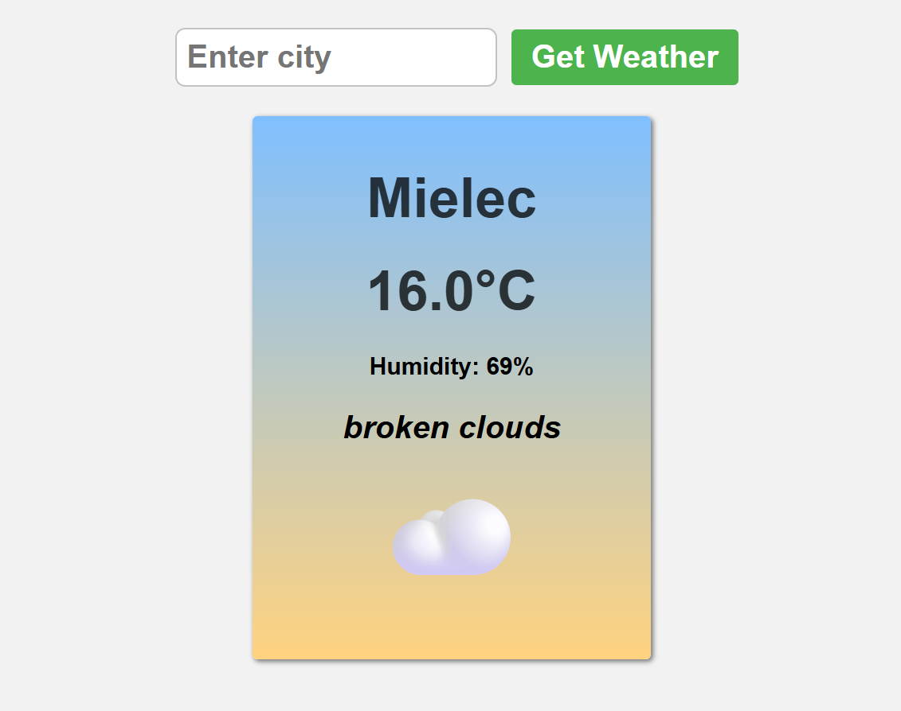

# 🌤️ Weather App

A simple and clean weather application built with **HTML, CSS and JavaScript** that fetches real-time weather data from the [OpenWeatherMap API](https://openweathermap.org/api).



---

## 🚀 Features

- Search for weather by city name
- Displays temperature (°C), humidity, description and weather emoji
- Handles API errors gracefully
- Responsive layout for mobile and desktop
- Light UI with smooth styling

---

## 🔑 How to use

To make this app work, **you must insert your own API key** from [OpenWeatherMap](https://openweathermap.org/api).

### 🔧 Steps to get a key:

1. Go to [https://openweathermap.org/api](https://openweathermap.org/api)
2. Create a **free account** (takes 1 minute)
3. Go to the API Keys section in your profile: [https://home.openweathermap.org/api_keys](https://home.openweathermap.org/api_keys)
4. Copy your API key
5. **It may take up to 15 minutes** before the key becomes active

### 📄 Then:

Open `config.js` and replace the placeholder value with your own key:

```js
// config.js
const API_KEY = 'your_openweathermap_api_key_here';
```

Make sure this file is present in your project directory.

---

⚠️ **Important:** Never share your real API key in public repositories!  
 Keep it private and do not commit `config.js` with your key.  
 This example includes a placeholder for learning purposes only.

## 🧪 Tech Stack

- HTML5
- CSS3
- JavaScript (ES6)
- Fetch API
- OpenWeatherMap

---

## 📁 File Structure

```
weather-app/
├── index.html
├── style.css
├── index.js
├── config.js        ← your API key goes here
└── README.md
```

---

## 🙋‍♂️ Author

Created by **Jakub Strycharz**

💡 This project was inspired by the BroCode tutorial on YouTube.  
I followed the core structure but added small improvements and extras for learning purposes.

---

## 📜 License

MIT – free to use, modify and distribute.
